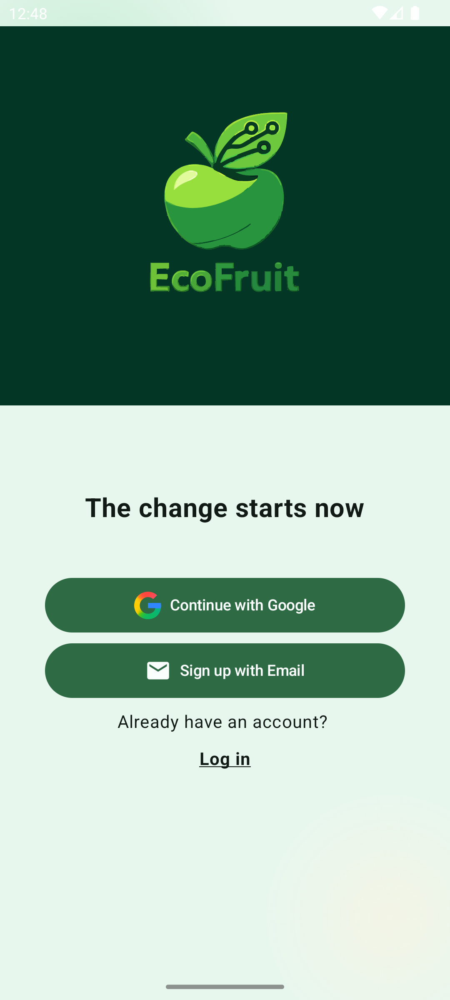
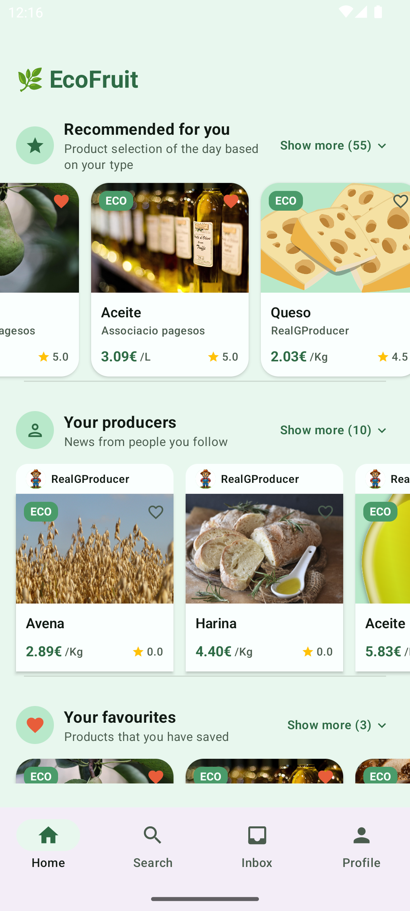
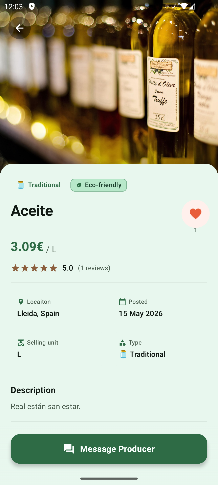
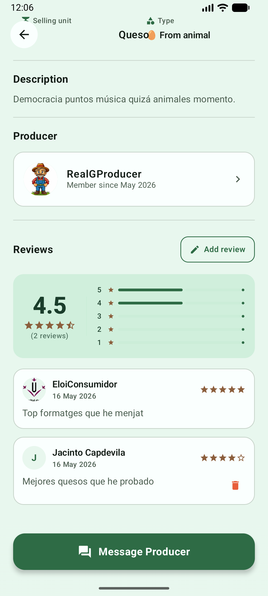
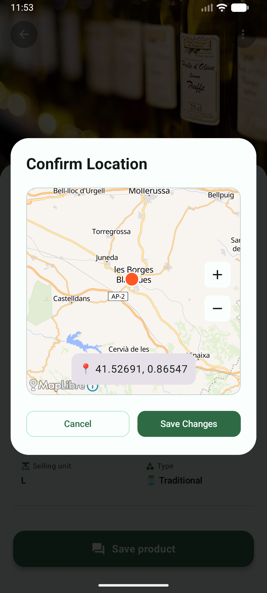
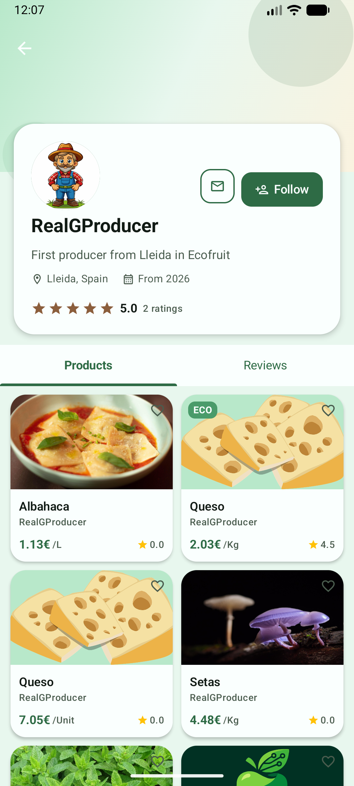
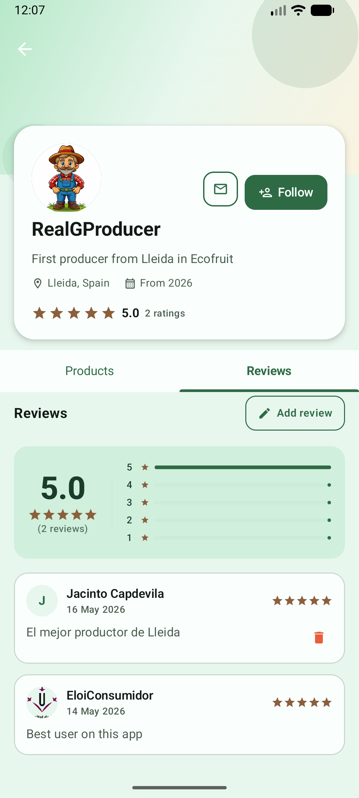
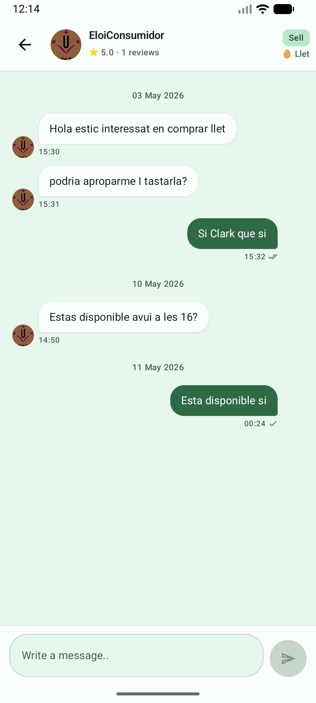
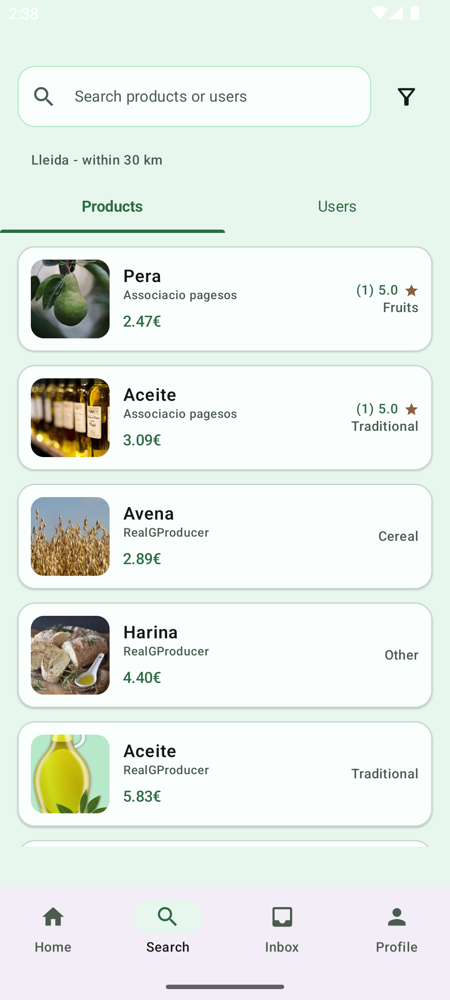

# 🍐 Ecofruit

Marketplace mòbil per a productes agrícoles desenvolupat en **Kotlin amb Jetpack Compose** i connectat a un projecte al núvol de **Firebase**.

---
## 🚀 Accés a l'aplicació

L'aplicació està integrada amb Firebase, així que les dades i les funcionalitats ja es gestionen al projecte al núvol i no queden limitades a una simple simulació en memòria.

Hi ha **3 maneres** d'accedir-hi:

### 1) Crear un compte nou

Pots registrar-te des de la pantalla de registre. En completar el procés, es farà l'enviament d'un **correu de confirmació**.

> ⚠️ Si no el veus a la safata d'entrada, revisa també la carpeta de **correu brossa / spam**.

### 2) Fer servir comptes creats manualment

També pots entrar amb comptes creats manualment per fer proves:

| Rol | Email | Contrasenya |
|-----|-------|-------------|
| Productor | `producer@email.com` | `123456789` |
| Consumidor | `eloiconsumidor@email.com` | `123456789` |

### 3) Fer servir comptes generats amb scripts

A [`scripts/`](./scripts/README.md) tens més referències sobre els comptes generats automàticament amb els scripts de suport.

La contrasenya comuna d'aquests comptes és:

| Camp | Valor |
|------|-------|
| Password | `Password123!` |

Aquests scripts tenen un toc bastant **vibecoded**: s'han creat aprofitant IA i alguna capa de feina personal per automatitzar la càrrega de dades, generar usuaris i facilitar proves ràpides del projecte.

---

## 🎨 Paleta de colors

L'aplicació utilitza un tema personalitzat basat en colors naturals i terrosos, amb suport per a **mode clar i fosc**.

---

## 🌿 Branques

| Branca           | Descripció |
|------------------|-----------|
| 🚀 `master`      | Contingut estable de l'entrega |
| 💻 `development` | Branca de treball activa |

---

## ✅ Funcionalitats implementades

Totes les funcionalitats següents estan implementades dins del projecte Firebase al núvol.

### Entrega anterior

A la primera entrega ja hi havia aquestes funcionalitats:

- Autenticació bàsica amb registre i inici de sessió amb usuaris mockejats
- Navegació principal entre seccions
- Preferències de xarxa: només WiFi o qualsevol connexió
- Tema clar i fosc
- Internacionalització preparada: anglès, català i castellà

### Aquesta entrega transició dades locals MOCK -> FIREBASE

En aquesta entrega s'han afegit i consolidat les funcionalitats següents:

- Autenticació completa: verificació de correu, restabliment de la contrasenya i inici de sessió amb Google
- Manteniment de la sessió de l'usuari
- Cerca i filtratge de productes
- Detall complet del producte
- Creació de valoracions per a productes i usuaris
- Generació de converses des del perfil d'un usuari
- Inbox en temps real amb actualització automàtica dels missatges rebuts
- Preferències d'idioma funcionals
- Preferències de notificacions tant per la creació de productes com de manera general
- Mostrar missatge en cas de pérdua de conexió a internet

---

## 🛠️ Distribució del projecte

- [`app/`](./app/README.md): aplicació mòbil desenvolupada en **Kotlin amb Jetpack Compose**.
- [`scripts/`](./scripts/README.md): scripts **vibecoded** per generar dades automatitzades, crear usuaris i donar suport a les proves del projecte.
- [`functions/`](./functions/README.md): **Firebase Cloud Functions** encarregades d'enviar notificacions als usuaris i donar suport a la lògica del núvol.

---

## 📱 Imatges
Algunes de les captures més representatives del projecte.

| | |                                                                                                         |
|---|---|---------------------------------------------------------------------------------------------------------|
| Pantalla principal  | Menú de navegació  | Detall d'un producte  |
| Ressenyes en producte  | Edició de localització  | Perfil d'usuari       |
| Perfil: ressenyes  | Comunicació entre usuaris  | Comunicació entre usuaris                           |

Més captures a [`screenshots/`](./screenshots/)
